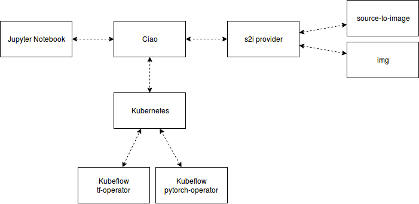
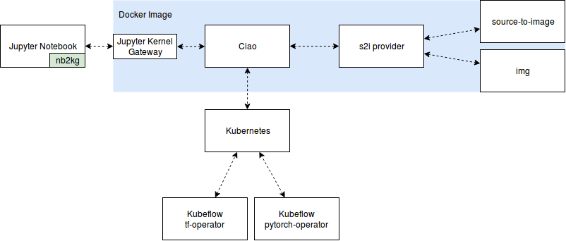

# Design Document

## Architecture

Ciao is a Jupyter kernel, and doesn’t know anything about the notebook document: it just gets sent cells of code to execute when the user runs them. If you want to know more about how the kernel and Jupyter Notebook work, please have a look at [How IPython and Jupyter Notebook work](https://jupyter.readthedocs.io/en/latest/architecture/how_jupyter_ipython_work.html).

The logic about the communication between Jupyter and Ciao is mostly copied from [gopherdata/gophernotes](https://github.com/gopherdata/gophernotes). Here we do not document how the kernel talks with Jupyter server via ZeroMQ, we mainly focus on how Ciao handles execution requests from Jupyter server.

## Handle requests

There are three phases in Ciao:

- In phase 1, Ciao interprets the magic commands and set the corresponding parameters to launch jobs.
- In phase 2, Ciao packages the source code to a Docker image, then push it to the registry.
- In phase 3, Ciao communicates with K8s apiserver to create resources (e.g. TFJob, PyTorchJob).

Each phase has a separate component to take care. Thus, we have three core components:

- Interpreter
- S2IClient
- Backend

### Interpreter

Interpreter interprets the magic commands in the code, e.g. `%kubeflow framework=tensorflow`. It reads all magic commands and generate a parameter for the following phases. You can get the definition of Interpreter here: [pkg/interpreter/types.go](https://github.com/caicloud/ciao/blob/master/pkg/interpreter/types.go).

### S2IClient

S2IClient converts source code to Docker image. There are some tools to achieve it, e.g. Knative build, source-to-image and Kaniko. We now use source-to-image to finish the phase. You can get the definition of S2IClient here: [pkg/s2i/types.go](https://github.com/caicloud/ciao/blob/master/pkg/s2i/types.go).

### Backend

Backend is the structure for Kubeflow and Kubernetes. We maintain Kubernetes Client and Kubeflow client in the backend and use them to create and watch resources. You can get the definition of Backend here: [pkg/backend/types.go](https://github.com/caicloud/ciao/blob/master/pkg/backend/types.go).

## Workflow

### Native kernel

If you want to run the kernel locally, you can refer to the workflow. In this mode, jupyter notebook server process manages Ciao. When the users in the notebook choose Ciao, Ciao will be spawned as a standalone process, then the notebook will use Ciao to run the code.

	

### Remote kernel (Dockerized)

If you want to run the kernel in a remote server, you can refer to the workflow. In this mode, jupyter notebook server does not talk to Ciao directly. It uses [nb2kg][] to communicate with [jupyter kernel gateway](https://github.com/jupyter/kernel_gateway) through HTTPS or Websocket. [nb2kg][] overrides the `/api/kernels/*` and `/api/kernelspecs` request handlers of the Notebook server, and proxies all requests for these resources to the Gateway.

	

The kernel gateway and Ciao are packaged in the Docker image, a port (default to `8889`) needs to be exposed in the container. Then the notebook can proxy all requests about kernel to the gateway.

[nb2kg]: https://github.com/jupyter/nb2kg
